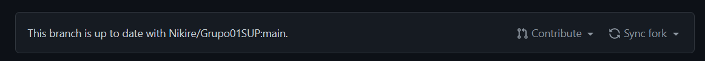
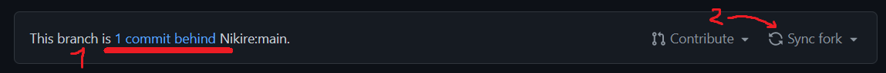
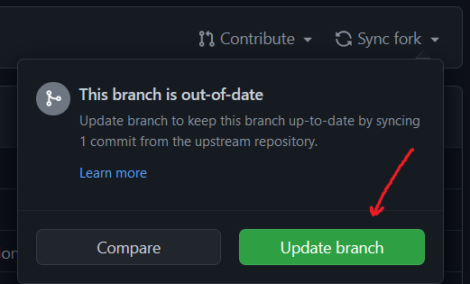

# Sincronizar repositorio

Si tu Fork está al día con el repositorio base y tiene todo, deberías encontrarte con un apartado así en tu repositorio de GitHub:



entonces si te aparece de esa manera, no hace falta que hagas la sincronización.
De lo contrario, debería aparecer algo asi:

<ol>
  <li>La cantidad de commits por detras que está tu fork actual</li>
  <li>Donde deberíamos apretar si queremos sincronizar nuestro fork al main</li>
</ol>


Una vez hecho esto, va a aparecer un cartel como el siguiente:



Y para finalizar la sincronización, deberían apretar en el botón que dice "Update branch" o "Actualizar rama".

Ahora lo que restaría hacer es una vez sincronizado el Fork con la main,parados sobre los archivos locales de su repositorio ( ya sea en el visual studio, bash o cualquier terminal compatible con git) realizar un git pull, para traer todos los archivos al repositorio local que no tengamos y que si existan en nuestro repositorio de GitHub.

```bash
git pull
```
